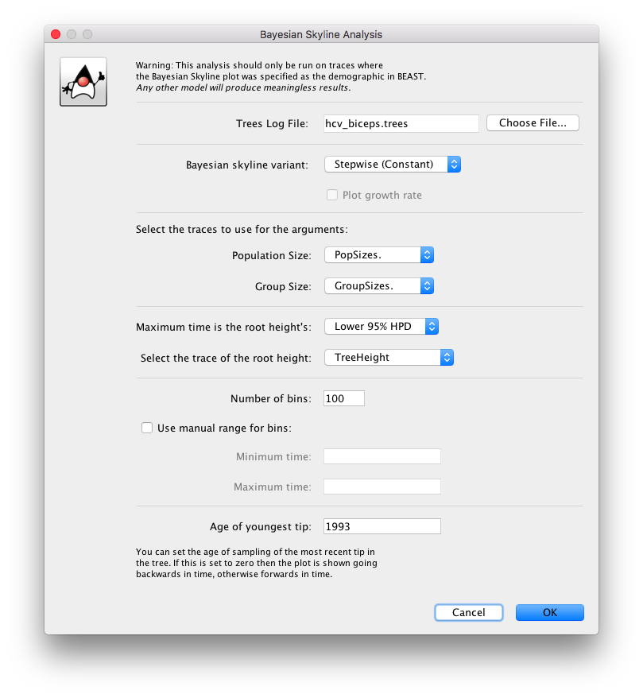

# BICEPS

[BEAST 2](http://beast2.org) package for Bayesian Integrated Coalescent Epoch PlotS + Yule Skyline models. It offers tree operators for more efficient mixing in tree space, and tree priors that are flexible and efficient for inference.

You can use BICEPS when:

* you are interested in inferring population histories,
* you are interested in inferring speciation histories,
* you are *not* interested in population or speciation histories, but need a flexible coalescent tree prior that does not get in the way.

Tutorials for [BICEPS](#biceps-tutorial) and [Yule-skyline](#yule-skyline-tutorial) on how to use below.

## Installation

Install BEAST 2 (available from [http://beast2.org](http://beast2.org)) and install the BICEPS package as follows:

> * Start BEAUti
>
> * Select the menu `File => Manage Packages`
>
> * Select `biceps` and click the `Install/Upgrade` button>
>
> * Click the `Close` button, and BICEPS should appear in the package list.

<figure>
        
        
        <figcaption>Figure 1: Manage packages menu in BEAUti.</figcaption>
</figure>

<figure>
        
        
        <figcaption>Figure 2: Package manager dialog.</figcaption>
</figure>

Alternatively, you can install BICEPS package through the [package manager](http://www.beast2.org/managing-packages/) (this may automatically install BEASTLabs as well if it is not already installed)

For population/speciation histories, use Tracer available [here](https://github.com/beast-dev/tracer/releases/).

------------------------------------------------------------------------------------------

## Using BICEPS -- tl;dr

* Use BEAUti to import an alignment and set up site and clock models
* In the priors tab, select `BICEPS` or `Yule Skyline` from the drop down menu associated with the tree prior
* Run BEAST on the XML file saved from BEAUti
* Optional: Use the Bayesian skyline reconstruction facility in Tracer to plot population histories or speciation through time

------------------------------------------------------------------------------------------

## Tutorial 1: Using BICEPS for demographic reconstruction

We will reconstruct the demographic history of Hepatitis C virus in Egypt, previously analysed in Drummond et al, 2005. The alignment is available [here](https://raw.githubusercontent.com/rbouckaert/biceps/master/examples/nexus/hcv.nexus). We will set up analysis in BEAUti, run it in BEAST, then analyse results in Tracer.

### Set up analysis in BEAUti

> * Start BEAUti
>
> * Select the menu `File => Import alignment` and pick `hcv.nexus` in the file dialog. The hcv-partition should appear in the partition panel in BEAUti.

<figure>
        
        
        <figcaption>Figure 3: Import alignment menu in BEAUti.</figcaption>
</figure>

<figure>
        
        
        <figcaption>Figure 4: Partition panel after importing hcv.nexus in BEAUti.</figcaption>
</figure>

> * Skip the tip dates panel -- there are no dates tips in this data set.
>
> * Select the `Site model` panel in BEAUti, set `Gamma category count` to 4, and set the substitution model to `GTR` by selecting it from the drop down box.

<figure>
        
        
        <figcaption>Figure 5: Site model panel in BEAUti.</figcaption>
</figure>

> * Select the `Clock model` panel in BEAUti. We will use a strict clock with fixed clock rate -- normally some uncertainty should be added to the clock rate, but for this tutorial we don't want the BEAST run to run for too long. Set `Clock.rate` to 0.00079.

<figure>
        
        
        <figcaption>Figure 6: Clock model panel in BEAUti.</figcaption>
</figure>

> * Select the `Priors` panel in BEAUti. We will use a BICEPS tree prior: select `BICEPS` from the drop down box next to `Tree.t:hvc`.

<figure>
        
        
        <figcaption>Figure 7: Select BICEPS tree prior in BEAUti.</figcaption>
</figure>

> * Click the small triangle next to BICEPS (left hand side) to show the options available for BICEPS.

<figure>
        
        
        <figcaption>Figure 8: BICEPS options in prior panel in BEAUti.</figcaption>
</figure>

BICEPS has the following options:

* ploidy (real number): Ploidy (copy number) for the gene, typically a whole number or half (default is 2) autosomal nuclear: 2, X: 1.5, Y: 0.5, mitrochondrial: 0.5. 
* populationShape (real number): Shape of the inverse gamma prior distribution on population sizes. 
* populationMean (real number): Mean of the inverse gamma prior distribution on population sizes. 
* groupCount (integer number): the number of groups used, which determines the dimension of the groupSizes parameter. If less than zero (default) 10 groups will be used, unless group sizes are larger than 30 (then group count = number of taxa/30) or less than 6 (then group count = number of taxa/6 (optional, default: -1)
*  groupSizes (integer numbers): The group sizes parameter. Ignored if equalEpochs=true. If not estimated (estimate=false on this parameter), fixed group sizes will be used, otherwise they will be estimated.If not specified, a fixed set of group sizes determined by the groupCount input will be used. (optional)
* equalEpochs (Boolean): if useEqualEpochs is false, use epochs based on groups from tree intervals, otherwise use equal sized epochs that scale with the tree height (optional, default: false)
* linkedMean (Boolean): use populationMean only for first epoch, and for other epochs use the posterior mean of the previous epoch 
* logMeans (Boolean): log mean population size estimates for each epoch 

> * In MCMC panel, set `Chain length` to 5 million, and log frequencies of trac and tree loggers to 5000. The log frequency for the screen logger can be set at 100000.
>
> * Save the file as `hcv_biceps.xml`

<figure>
        
        
        <figcaption>Figure 9: MCMC setting in BEAUti.</figcaption>
</figure>

### Run MCMC in BEAST

Start BEAST and run the XML file `hcv_biceps.xml`. This produces a log file and a trees file that we will use for inferring the population history.

### Demographic reconstruction

> * Start Tracer
>
> * Import the trace log file `hcv_biceps.log` produced by the BEAST run, either by dragging the file from a file manager to the top left `Trace Files` list, or by clicking the small '+' button underneath that list and selecting the file via the file dialog.
>
> * Select menu `Analysis => Bayesian skyline reconstruction`. A dialog pops up with a number of options.

<figure>
        
        
        <figcaption>Figure 10: Skyline reconstruction menu in Tracer.</figcaption>
</figure>

> * Select the accompanying trees file by clicking the `Choose file` button next to `Trees log file` and select the trees file produced by BEAST (`hcv_biceps.trees`).
>
> * Set age of the youngest tip to 1993. Setting the age makes the plot go forward in time. Leaving it zero makes the plot go backward in time.

<figure>
        
        
        <figcaption>Figure 11: Skyline reconstruction panel in Tracer.</figcaption>
</figure>

> * Click the `OK` button. After a short time, a dialog pops up that shows the population history in Tracer.

<figure>
        
        
        <figcaption>Figure 12: Popualation history of HCV in Tracer.</figcaption>
</figure>

### Trouble shooting

It is not unusual to find large stretches of horizontal lines near the root of the tree, since BICEPS assumes a piecewise constant population size within each epoch. The length of an epoch is determined by the number of groups. Group sizes are equally sized (with at most a difference of 1 in group sizes). There are two ways to reduce the long stretches of horizontal lines in the reconstruction:

* increase the number of groups by setting the `group count` entry in the BICEPS options. This way, the long epoch may be split up into smaller intervals.
* If the estimated flag is not set on `group sizes`, they remain constant throughout the MCMC, which helps with mixing, but may result in large groups near the root. Setting the estimate flag checked for the BICEPS prior allows estimation of group sizes and usually results in more variability in the reconstruction.

------------------------------------------------------------------------------------------

## Tutorial 2: Speciation through time using the Yule Skyline tree prior

We are going to use the same data as for the BICEPS tree prior from Tutorial 1, but now with the Yule skyline tree prior, which allows us to reconstruct the speciation rate of the virus. Since we already set up the site model, clock model and MCMC parameters before, we are gong to load the XML into BEAUti, then adjust the tree prior only.

> * Start BEAUti
>
> * Select the menu `File => Load`, and select the file `hcv_biceps.xml` that we saved before. The hcv-partition appears in the partitions panel in BEAUti.
>
> * Click the `Priors` panel, and select `Yule Skyline` from the drop down box next to `Tree.t:hcv`

<figure>
        
        
        <figcaption>Figure 13: Yule skyline prior in BEAUti.</figcaption>
</figure>

> * Click the small triangle next to `Yule Skyline` to show the options:

<figure>
        
        
        <figcaption>Figure 14: Yule skyline prior options in BEAUti.</figcaption>
</figure>

YuleSkyline has the following options:

* birthRateShape (real number): Shape of the gamma prior distribution on birth rates.
* birthRateRate (real number): Rate of the gamma prior distribution on birth rates. 
* groupCount, groupSizes, equalEpochs, linkedMean and logMeans are the same as for the BICEPS tree prior (see listed in Tutorial 1).

> * Before saving as `hcv_yule_skyline.xml`, you might want to change the file names in the `MCMC` panel (if they are not using the `$(filebase)` phrase).

### Run MCMC in BEAST

Start BEAST and run the XML file `hcv_yule_skyline.xml`. This produces a log file and a trees file that we will use for inferring the speciation history. It takes a few minutes to run, so this is a good time for a break.

### Speciation rate reconstruction through time

We can use Tracer to reconstruct the speciation rate of HCV through time.

> * Start Tracer
>
> * Import the trace log file `hcv_yule_skyline.log` produced by the BEAST run, either by dragging the file from a file manager to the top left `Trace Files` list, or by clicking the small '+' button underneath that list and selecting the file via the file dialog.
>
> * Select menu `Analysis => Bayesian skyline reconstruction`. A dialog pops up with a number of options (see Figure 10).
>
> * Select the accompanying trees file by clicking the `Choose file` button next to `Trees log file` and select the trees file produced by BEAST (`hcv_yule_skyline.trees`).
>
> * Set age of the youngest tip to 1993. Setting the age makes the plot go forward in time. Leaving it zero makes the plot go backward in time. The panel should look like Figure 11, but with `hcv_yule_skyline.trees` instead of `hcv_biceps.trees` for the trees file.
>
> * Click the `OK` button. A dialog pops up with the speciation history displayed, which looks similar to this:

<figure>
        
        
        <figcaption>Figure 15: Yule skyline reconstruction in Tracer.</figcaption>
</figure>

The history accompanies the demographic reconstruction, which shows an explosion in the 1920s coinciding with a large speciation rate at the same time. Later, speciation rates decrease, but infections remain at a high level.

------------------------------------------------------------------------------------------

## Questions about BICEPS

BEAST user list: [https://groups.google.com/forum/#!forum/beast-users](https://groups.google.com/forum/#!forum/beast-users)

Remco Bouckaert: [r.bouckaert@auckland.ac.nz](r.bouckaert@auckland.ac.nz)

## References

Remco R Bouckaert. "An Efficient Coalescent Epoch Model for Bayesian Phylogenetic Inference", Systematic Biology, syac015, 2022
[DOI:10.1093/sysbio/syac015](https://doi.org/10.1093/sysbio/syac015)

Drummond AJ, Rambaut A, Shapiro BE, Pybus OG. "Bayesian coalescent inference of past population dynamics from molecular sequences", Molecular Biology and Evolution. 22(5):1185-92, 2005.

